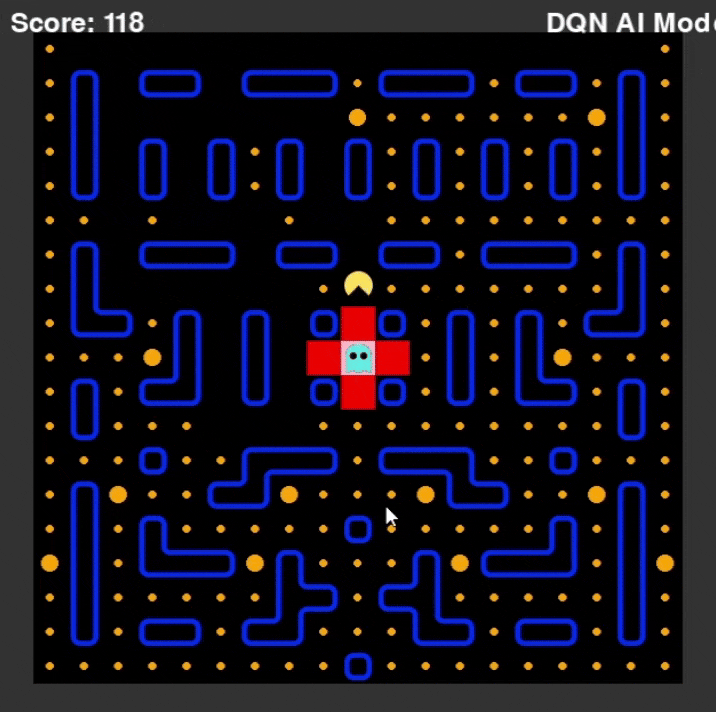

# Pac-Man 遊戲專案

這是一個基於 **Pygame** 的 Pac-Man 遊戲實現，採用物件導向程式設計（OOP）原則，結合 **深度 Q 學習（DQN）** 和 **規則基礎 AI** 控制策略。專案支援隨機迷宮生成、多樣化的鬼魂行為、玩家手動控制與 AI 自動控制，並提供 DQN 代理的訓練功能以及訓練結果的可視化工具。透過 OOP 設計，程式碼模組化、可維護且易於擴展，遊戲邏輯清晰分層，適合學習遊戲開發與強化學習。

---



---
## 📂 專案結構

以下是專案的目錄結構與主要模組說明：

```
oop-2025-proj-pacman/
├── main.py                 # 遊戲主程式，負責初始化與運行遊戲
├── config.py               # 定義遊戲常量與配置（迷宮尺寸、顏色等）
├── scores.json             # 儲存遊戲分數記錄
├── episode_rewards.json    # 儲存 DQN 訓練的回合獎勵
├── pacman_dqn.pth          # DQN 模型檔案
├── pacman_dqn_final.pth    # 最終訓練完成的 DQN 模型
├── replay_buffer.pkl       # DQN 回放緩衝區檔案
├── replay_buffer_final.pkl # 最終訓練完成的回放緩衝區
├── optuna.db               # Optuna 超參數優化資料庫
├── .gitattributes          # Git 屬性配置
├── .gitignore              # Git 忽略檔案清單
├── ai/                     # AI 與 DQN 相關模組
│   ├── agent.py           # DQN 代理，管理記憶緩衝與訓練邏輯
│   ├── dqn.py             # DQN 神經網路模型定義
│   ├── environment.py     # 強化學習環境（PacManEnv）
│   ├── plot_metrics.py    # 繪製訓練獎勵與損失圖表，輸出為 PNG
│   ├── sumtree.py         # 優先經驗回放的 SumTree 資料結構
│   ├── test_cuda.py       # 檢查 CUDA 可用性的工具腳本
│   ├── train.py           # DQN 訓練迴圈，支援 TensorBoard 記錄
│   ├── __init__.py
│   └── __pycache__/       # Python 編譯快取
├── assert/                 # 遊戲圖片資源
│   ├── ghosts/            # 鬼魂圖片（不同顏色與狀態）
│   ├── pacman/            # Pac-Man 圖片（不同方向與動畫）
│   └── wall/              # 迷宮牆壁與豆子圖片
├── docx/                   # 文件資料夾
│   ├── classdiagram.md    # 類別圖，描述物件關係（Mermaid 格式）
│   ├── requirements.txt   # Python 依賴清單
│   ├── dqn_agent_explained.markdown        # DQN 代理詳解
│   ├── ghost_behavior_explained.markdown   # 鬼魂行為詳解
│   ├── pacman_behavior_explained.markdown  # Pac-Man 行為詳解
│   ├── pacman_env_explained.markdown       # 環境詳解
│   ├── pacman_maze_generation_explained.markdown # 迷宮生成詳解
│   ├── train_explained.markdown            # 訓練流程詳解
├── game/                   # 遊戲邏輯與環境模組
│   ├── game.py            # 核心遊戲邏輯，管理狀態更新與碰撞檢測
│   ├── maze_generator.py  # 隨機迷宮生成器，包含牆壁與路徑
│   ├── menu.py            # 遊戲選單介面
│   ├── renderer.py        # 使用 Pygame 渲染遊戲畫面
│   ├── strategies.py      # 控制策略（玩家、規則 AI、DQN AI）
│   ├── __init__.py
│   ├── entities/          # 遊戲實體定義
│   │   ├── entity_base.py # 實體基類
│   │   ├── entity_initializer.py # 初始化遊戲實體
│   │   ├── ghost.py       # 鬼魂實體，包含規則基礎行為
│   │   ├── pacman.py      # Pac-Man 實體，包含移動邏輯
│   │   ├── pellets.py     # 分數球與能量球
│   │   ├── __init__.py
│   │   └── __pycache__/
│   └── __pycache__/
├── members/                # 開發成員資訊
│   ├── 113511002.txt
│   ├── 113511034.txt
│   ├── 113511264.txt
├── runs/                   # TensorBoard 訓練記錄
├── tests/                  # 單元測試模組
│   ├── test_config.py
│   ├── test_entity_initializer.py
│   ├── test_ghost.py
│   ├── test_maze_generator.py
│   ├── test_menu.py
│   ├── test_pacman.py
│   ├── test_pellets.py
│   ├── test_renderer.py
│   ├── test_strategies.py
│   └── __pycache__/
└── __pycache__/            # Python 編譯快取
```

### **重要檔案說明**
- **`config.py`**：定義遊戲常量（如迷宮寬度 `MAZE_WIDTH`、格子大小 `CELL_SIZE`），統一全局配置，避免硬編碼。
- **`docx/classdiagram.md`**：使用 Mermaid 繪製類別圖，展示 OOP 設計的類別關係。
- **`docx/requirements.txt`**：列出 Python 依賴，確保環境一致。
- **`assert/image/`**：儲存遊戲圖片資源，包括 Pac-Man、鬼魂、牆壁和豆子的圖像。

---

## 🚀 快速開始

### **環境要求**
- **重要**：由於 PyTorch 官方並沒有釋出 torch==2.7.0+cu126 這個 wheel ，目前docker不可用
- **Python**：建議 3.10 以上（3.8 以上亦可，若需 3.13 請自行安裝）
- **依賴套件**：
  - Pygame 2.6.1
  - PyTorch（CPU 或 GPU，請依據自己的 CUDA 版本選擇安裝）
  - NumPy
  - Matplotlib
  - TensorBoard
  - Optuna

**安裝依賴**：

最推薦方式（自動安裝 requirements.txt 內所有依賴）：
```bash
pip install -r docx/requirements.txt
```

> **若你需要 GPU 支援，請依 [PyTorch 官方安裝指引](https://pytorch.org/get-started/locally/) 選擇對應 CUDA 版本的 wheel，並參考如下命令：**
> ```bash
> pip3 install torch torchvision torchaudio --index-url https://download.pytorch.org/whl/cu126
> ```

或手動安裝其它依賴：
```bash
pip install pygame numpy matplotlib tensorboard optuna
```

如只需 CPU 版 PyTorch，可直接：
```bash
pip install torch
```
如需 GPU 版，請確認你的 CUDA 驅動版本，並參考官方指引安裝對應版本的 PyTorch。

### **運行遊戲**
執行以下命令啟動遊戲：
```bash
python main.py
```

**控制方式**：
- **方向鍵（↑↓←→）**：控制 Pac-Man 移動。
- **ESC**：暫停遊戲，顯示選單。

### **訓練 DQN 代理**
執行 `ai/train.py` 訓練 DQN 代理，支援模仿學習預訓練、混合精度訓練（AMP）、早期停止和超參數優化。

**基本訓練命令**：
```bash
python ai/train.py
```

**繼續訓練（載入現有模型）**：
```bash
python ai/train.py --resume
```

**使用 Optuna 優化超參數**：
```bash
python ai/train.py --optuna
```

**自訂超參數訓練**（範例）：
```bash
python ai/train.py --lr=0.00001 --batch_size=32 --target_update_freq=2 --sigma=0.05 --n_step=4 --gamma=0.97 --alpha=0.5 --beta=0.3 --beta_increment=0.002 --expert_prob_start=0.05 --expert_prob_end=0.03 --expert_prob_decay_steps=100000 --expert_random_prob=0.125 --max_expert_data=100000 --ghost_penalty_weight=10 --pretrain_episodes=100 --episodes=10000
```

---

## ⚙️ 訓練選項

### **通用選項**
- **`--resume`**（布林值，預設：`False`）  
  從指定的模型檔案（`--model_path`）和回放緩衝區（`--memory_path`）繼續訓練。
- **`--optuna`**（布林值，預設：`False`）  
  使用 Optuna 進行超參數優化，自動試驗 50 次，結果儲存於 `optuna.db`。

### **訓練設置**
- **`--episodes`**（整數，預設：`1000`）  
  總訓練回合數。
- **`--pretrain_episodes`**（整數，預設：`100`）  
  預訓練時收集專家數據的回合數。
- **`--early_stop_reward`**（浮點數，預設：`10000`）  
  當最近 100 回合平均獎勵達到此值，提前停止訓練。
- **`--model_path`**（字串，預設：`"pacman_dqn.pth"`）  
  DQN 模型的儲存/載入路徑。
- **`--memory_path`**（字串，預設：`"replay_buffer.pkl"`）  
  回放緩衝區的儲存/載入路徑。

### **DQN 模型參數**
- **`--lr`**（浮點數，預設：`0.001`）  
  學習率，控制神經網絡參數更新的速度。
- **`--batch_size`**（整數，預設：`128`）  
  每次訓練的經驗批次大小。
- **`--target_update_freq`**（整數，預設：`10`）  
  目標網絡更新的頻率（回合數）。
- **`--sigma`**（浮點數，預設：`0.3`）  
  Noisy DQN 的噪聲因子，控制動作探索程度。
- **`--n_step`**（整數，預設：`8`）  
  N 步回報的步數，影響長期獎勵計算。
- **`--gamma`**（浮點數，預設：`0.95`）  
  折扣因子，控制未來獎勵的重要性。
- **`--alpha`**（浮點數，預設：`0.8`）  
  優先經驗回放的 alpha 參數，控制經驗採樣優先級。
- **`--beta`**（浮點數，預設：`0.6`）  
  優先經驗回放的 beta 參數，控制重要性採樣權重。
- **`--beta_increment`**（浮點數，預設：`0.0001`）  
  每步訓練的 beta 增量。
- **`--expert_prob_start`**（浮點數，預設：`0.3`）  
  初期使用專家動作的概率。
- **`--expert_prob_end`**（浮點數，預設：`0.01`）  
  最終使用專家動作的概率。
- **`--expert_prob_decay_steps`**（整數，預設：`500000`）  
  專家概率從起始到結束的衰減步數。
- **`--ghost_penalty_weight`**（浮點數，預設：`3.0`）  
  靠近鬼魂的懲罰權重，影響獎勵計算。

### **專家數據收集參數**
- **`--expert_episodes`**（整數，預設：`100`）  
  收集專家數據的回合數。
- **`--expert_max_steps_per_episode`**（整數，預設：`200`）  
  每個專家回合的最大步數。
- **`--expert_random_prob`**（浮點數，預設：`0.1`）  
  專家數據收集時隨機選擇動作的概率。
- **`--max_expert_data`**（整數，預設：`10000`）  
  收集的最大專家數據量。

---

## 📊 訓練輸出

- **TensorBoard 記錄**（儲存於 `runs/`）：
  - `Reward`：每回合的總獎勵。
  - `Mean_Q_Value`：平均 Q 值。
  - `Loss`：訓練損失。
  - `Lives_Lost`：每回合的生命損失次數。
  - `Action_i_Ratio`：動作分佈比例（上、下、左、右）。
  - `Expert_Probability`：當前專家動作概率。
  - `Avg_Ghost_Distance`：平均鬼魂距離。
  - `Ghost_Encounters`：鬼魂遭遇次數。
  - Noisy DQN 噪聲指標（例如 `FC1_Weight_Sigma`）。

- **模型與記憶緩衝**：
  - 中間模型：`pacman_dqn.pth` 和 `replay_buffer.pkl`（每 5 回合儲存）。
  - 最終模型：`pacman_dqn_final.pth` 和 `replay_buffer_final.pkl`。

- **回合數據**：
  - 回合獎勵：`episode_rewards.json`。

---

## 📈 可視化訓練結果

生成訓練圖表：
```bash
python ai/plot_metrics.py
```

- 輸出：`training_metrics.png`，顯示獎勵與損失曲線。

即時查看 TensorBoard：
```bash
tensorboard --logdir runs
```

- 在瀏覽器中開啟 `http://localhost:6006` 查看訓練指標。

---

## 🛠️ 檢查 CUDA 環境

檢查 GPU 可用性：
```bash
python ai/test_cuda.py
```

- 確認 PyTorch 是否正確使用 CUDA，確保訓練加速。

---

## 🐛 已知問題與改進計劃

- **DQN AI 表現**：
  - 問題：AI 會主動尋找能量球，偶爾吃鬼魂，但躲避鬼魂的能力不足。
  - 改進：優化 `PacManEnv` 的獎勵機制，增強躲避鬼魂的策略（試驗中）。
---

## 💡 開發團隊

由 **Group 6** 開發，感謝以下成員的貢獻（詳見 `members/`）：

---

## 📚 參考文獻

- [Optuna: A Next-generation Hyperparameter Optimization Framework](https://dl.acm.org/doi/10.1145/3292500.3330701)  
  - 超參數優化工具。
- [Pac-Man Maze Generation](https://shaunlebron.github.io/pacman-mazegen/)  
  - 迷宮生成設計靈感。
- [Human-level control through deep reinforcement learning](https://www.nature.com/articles/nature14236?wm=book_wap_0005)  
  - DQN 基礎架構。
- [Noisy Networks for Exploration](https://arxiv.org/abs/1706.10295)  
  - Noisy DQN 增強探索。
- [Dueling Network Architectures for Deep Reinforcement Learning](https://arxiv.org/abs/1511.06581)  
  - Dueling DQN 架構。
- [Rainbow: Combining Improvements in Deep Reinforcement Learning](https://arxiv.org/abs/1710.02298)  
  - 整合多種 DQN 改進。
- [PyTorch Official Website](https://pytorch.org/)  
  - DQN 訓練框架。
- [PyTorch: An imperative style, high-performance deep learning library](https://arxiv.org/abs/1912.01703)  
  - PyTorch 技術詳解。
- [OpenAI Gym](https://github.com/openai/gym)  
  - 強化學習環境設計靈感。
- [Mastering the game of Go with deep neural networks and tree search](https://www.nature.com/articles/nature16961)  
  - 模仿學習與強化學習結合的靈感。

---

## 📝 文件資源

專案提供詳細的技術說明文件，位於 `docx/` 資料夾：
- **dqn_agent_explained.markdown**：DQN 代理的運作機制。
- **ghost_behavior_explained.markdown**：鬼魂行為與策略。
- **pacman_behavior_explained.markdown**：Pac-Man 的移動與邏輯。
- **pacman_env_explained.markdown**：強化學習環境詳解。
- **pacman_maze_generation_explained.markdown**：迷宮生成原理。
- **train_explained.markdown**：DQN 訓練流程解析。
